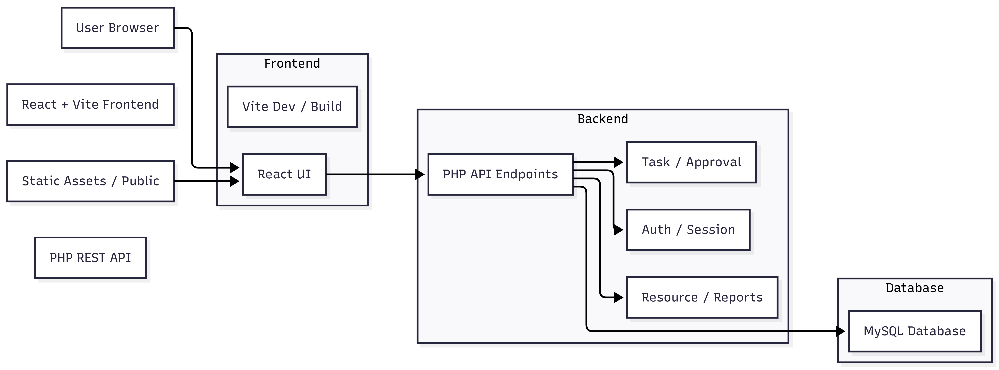

<div align="center">
  <h1>SmartFlow</h1>
  <p>Task and resource management platform with dashboards, approvals, resources, notifications, and role-aware workflows.</p>
</div>

## Overview

SmartFlow is a full-stack web app for managing work execution across teams.

- Frontend: React + TypeScript + Vite + Tailwind
- Backend: PHP (REST-style endpoints)
- Database: MySQL (via PDO)

## Core Features

### Tasks
- Create, update, delete, and view tasks
- Status workflow: pending, in-progress, review, completed
- Priority and assignee support
- Task detail with comments/attachments counts

### Approvals
- Submit approval requests
- Approve/reject requests
- Department and status tracking

### Resources
- Manage inventory (device, software, room, equipment)
- Track resource status (available, assigned, maintenance)
- Assign/release resources

### Dashboard and Reporting
- KPI cards from live database counts
- Weekly and monthly chart data from DB
- Activity feed (latest events)
- Reports endpoint for aggregate metrics

### User and Profile
- Register and login
- Session/token-based frontend state
- Profile update and avatar upload
- Settings and notifications

## Architecture



## Tech Stack

- React 18 + TypeScript
- Vite
- Tailwind CSS + shadcn/ui
- PHP 7+
- MySQL

## Quick Start

### 1. Clone repository

```bash
git clone https://github.com/Nirjar26/SmartFlow.git
cd SmartFlow
```

### 2. Install frontend dependencies

```bash
npm install
```

### 3. Configure backend environment

Create or update backend/.env:

```env
DB_HOST=localhost
DB_NAME=flowstone_db
DB_USER=root
DB_PASS=

APP_ENV=development
API_BASE_URL=http://localhost:8000/backend
FRONTEND_URL=http://localhost:8080
```

### 4. Start backend server

Run from project root so /backend/*.php URLs are reachable:

```bash
php -S localhost:8000
```

### 5. Start frontend

```bash
npm run dev
```

## Minimal Data Setup

Baseline includes:

- 2 users
- 2 tasks
- 1 approval
- 2 resources
- 1 notification
- 1 activity

Default admin login:

```text
Email: admin@flowstone.com
Password: password123
```

## API Base Path

Frontend currently calls endpoints under:

```text
http://localhost:8000/backend/
```

Examples:

- POST /backend/login.php
- GET /backend/tasks.php
- POST /backend/create_task.php
- GET /backend/dashboard.php

## Project Structure

```text
.
├── backend/
│   ├── config.php
│   ├── full_schema.sql
│   ├── scripts/
│   │   ├── reset_admin_credentials.php
│   │   └── reset_minimal_data.php
│   ├── migrations/
│   ├── uploads/
│   └── *.php
├── src/
│   ├── admin/
│   ├── components/
│   ├── hooks/
│   ├── lib/
│   ├── pages/
│   ├── App.tsx
│   └── main.tsx
├── diagram/
├── docs/
├── public/
├── package.json
└── README.md
```

## Development Notes

- Backend schema bootstrap is handled in backend/config.php when required tables are missing.
- Dashboard data now reads from live DB queries (no hardcoded seeded chart arrays).
- If PHP returns 404 for endpoints, verify you started server from project root, not backend folder.

## Author

Nirjar Goswami
- GitHub: https://github.com/Nirjar26

Swara Shah
- GitHub: https://github.com/Swara107

Associated with CHARUSAT University.
